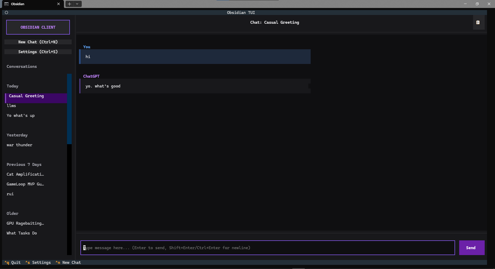

### ObsidianTUI

A Terminal UI frontend for chatgpt.com.



**what this is**

[Obsidian Client](https://github.com/debxylen/Obsidian-Client), but in the terminal.
basically a terminal UI wrapper around chatgpt.com's internal web endpoints.

**features**

* ChatGPT-like terminal interface
* conversations sidebar
* streaming responses
* persistent login via token + cookies
* conversation history loading
* new chat initiation
* copy conversation web urls

**to be done**

* images
* file uploads
* message edits
* chat deletion
* thinking mode
* conversation search
* personalization settings

**setup**

```bash
$ git clone https://github.com/debxylen/Obsidian-TUI obsidian
$ cd obsidian

$ python -m venv venv
$ source venv/bin/activate  # (windows: .\venv\Scripts\activate)

$ pip install -r requirements.txt
$ python main.py
```

check [releases](https://github.com/debxylen/Obsidian-TUI/releases) for prebuilt binaries

**notes**

* this depends on internal ChatGPT web APIs, so it might break someday. has been stable for quite sometime though.
* depends on keyring, so your OS's credential manager. should be fine on most OS/distros still.

**about warnings**

you might get a "someone else might be using your account" warning
since the endpoints are accessed with the web access token, but never 'logged in' w/ the terminal environment.
setting the actual browser cookie string from a completion request made in the actual site can help.
